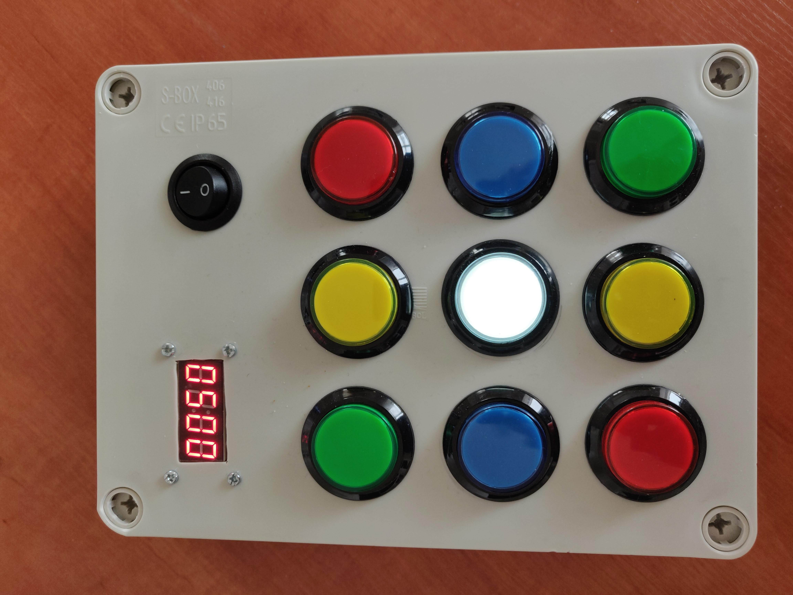
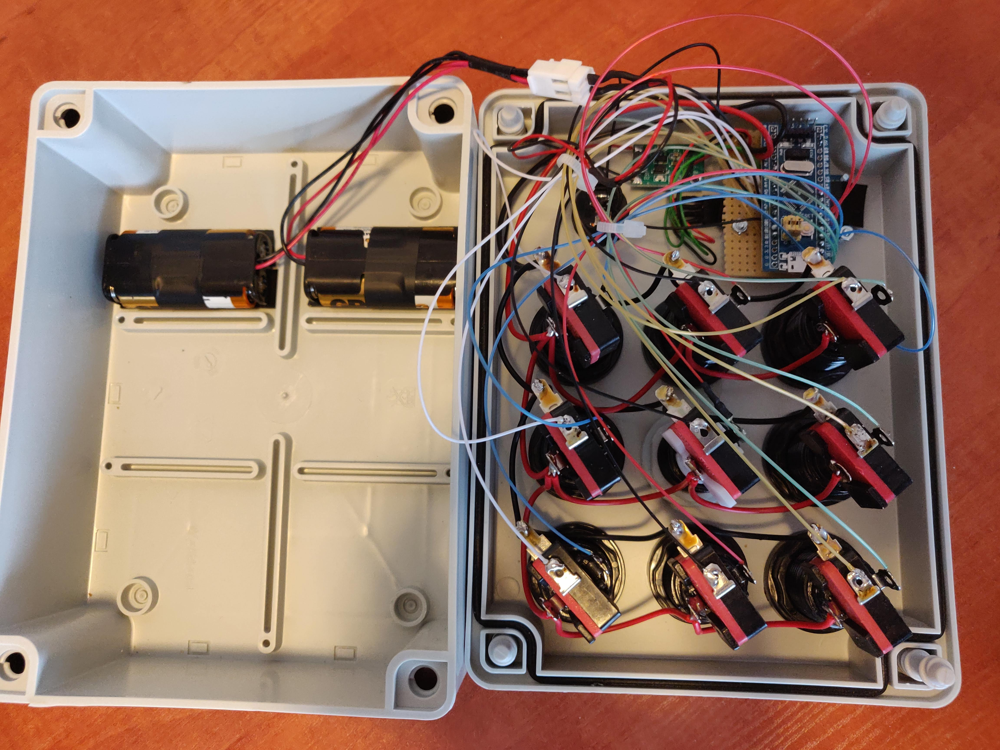

# Game box with Arcade buttons

A toy containing two games: Speed and memory. Player has to press buttons that are lit up. Each press adds a point. If player press incorrect button - game ends. With higher points, game gets harder.

Running on STM32F103 MCU.

  

[Video](photos/video.mp4)
